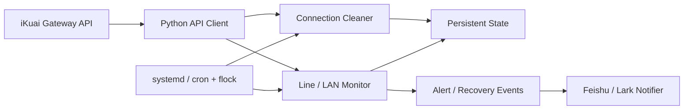

# Homelab Network Automation

[](#)
[](#)
[](#)
[](#status)

**English** · [简体中文](README.zh-CN.md)

A sanitized portfolio reconstruction of automation that previously operated an **iKuai-based personal homelab**. It combines router API integration, stateful connection-management policies, WAN/PPPoE/LAN health monitoring, persistent alert state, and Linux service scheduling.

The original deployment has been retired. This public version preserves the engineering patterns while removing credentials, account identifiers, private topology details, internal host labels, and production paths.

## Why this project

The homelab contained multiple downstream hosts and WAN/PPPoE lines. Repeated manual inspection did not scale, while blindly resetting connections would have been risky. The automation therefore treated network actions as policy decisions rather than one-off shell commands.

The cleaner only acts after multiple safeguards agree: explicit address allow-lists, exception lists, active time windows, consecutive low-throughput samples, per-host cooldowns, per-cycle limits, and persistent state. Monitoring uses similar stateful logic so transient API omissions do not immediately become outage alerts.

## What it demonstrates

- **iKuai API integration:** reusable client for `/Action/login` and `/Action/call`.
- **Stateful connection cleanup:** allow-list + exception list + consecutive-sample + cooldown guards.
- **Blast-radius control:** per-cycle clear limits and dry-run-first operation.
- **WAN / PPPoE / LAN monitoring:** multiple API views combined into a single health model.
- **Noise-resistant alerting:** consecutive-miss suppression, deduplication, recovery tracking, and persisted state.
- **Notification delivery:** Feishu/Lark notification queue with retry persistence.
- **Linux operations:** systemd and cron/`flock` deployment examples.
- **Portfolio sanitization:** secrets and site-specific production information are intentionally excluded.

## Architecture



## Repository layout

```text
src/ikuai_automation/
  api.py                  iKuai HTTP API client
  config.py               JSON config + ${ENV_VAR} expansion
  connection_cleaner.py   stateful connection-reset policy
  line_monitor.py         WAN/PPPoE/LAN monitoring
  feishu_notifier.py      notification + retry queue
config/
  config.example.json
deployment/
  systemd/
  cron/
docs/
  architecture.md
tests/
```

## Quick start

```bash
python3 -m venv .venv
source .venv/bin/activate
pip install -e '.[dev]'
cp config/config.example.json config/config.json
cp .env.example .env
```

Load environment variables with your preferred secret-management method. For a local shell:

```bash
set -a
source .env
set +a
```

Run tests:

```bash
pytest -q
```

Run a **non-destructive** cleaner pass first:

```bash
ikuai-cleaner --config config/config.json --once --dry-run
```

Run one monitor pass:

```bash
ikuai-monitor --config config/config.json
```

Run the monitor and send notifications when a new alert or recovery exists:

```bash
ikuai-notify --config config/config.json
```

## Safety controls

Connection reset is a destructive network action. The public implementation keeps the same defensive design principles used by the original automation:

| Control | Purpose |
| --- | --- |
| `allowed_clear_ranges` | Hard boundary around addresses eligible for reset |
| `except_ips` | Addresses that must never be reset |
| `low_upload_samples` | Consecutive low-throughput observations required before action |
| `cooldown_seconds` | Minimum delay before the same host may be reset again |
| `max_clears_per_cycle` | Limits the blast radius of one polling cycle |
| `active_group_windows` | Time-based group activation and clear enable/disable |
| `live_special_ips` | Alternate rule for selected high-connection-count hosts |
| `--dry-run` | Observe decisions without performing resets |

TLS verification is configurable because some homelab routers use self-signed certificates. Prefer a trusted certificate and `verify_tls: true` where possible.

## Deployment

The original environment used Linux service scheduling. Sanitized examples under `deployment/` include:

- a hardened systemd service for the long-running connection cleaner;
- a cron entry using `flock` to prevent overlapping monitor jobs.

Adjust paths, users, secrets, permissions, and thresholds before adapting the examples to another environment.

## Sanitization note

This public repository does **not** contain the original router password, notification credentials, PPPoE account identifiers, internal machine labels, production file paths, or the original site-specific addressing plan.

The goal is to demonstrate the engineering approach without exposing operational infrastructure.

## Status

**Archived / Portfolio Project.** The original deployment has been retired. The repository remains as a reviewable example of network automation, stateful monitoring, defensive operations, and Linux service integration.