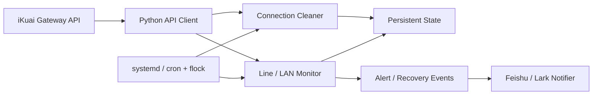

# Homelab Network Automation

[](#)
[](#)
[](#)
[](#项目状态)

[English](README.md) · **简体中文**

这是一个从真实个人 Homelab 运维自动化中整理出来的**脱敏作品集项目**。原系统围绕 iKuai 网关运行，涵盖路由器 API 调用、状态化连接管理、WAN/PPPoE/LAN 健康监控、持久化告警状态，以及 Linux 服务调度。

原部署已经停止使用。公开版本保留核心工程思路，同时移除了账号密码、PPPoE 标识、真实网络拓扑、内部设备名称和生产路径等敏感信息。

## 为什么做这个项目

原 Homelab 中存在多台下游设备和多条 WAN/PPPoE 线路。靠人工反复检查效率很低，但如果简单粗暴地自动清连接，又容易误伤正常设备。因此，这套工具把“执行网络操作”设计成一套带状态和安全边界的策略，而不是单纯执行一次命令。

连接清理器只有在多项条件同时满足时才会执行：明确的地址白名单、例外列表、启用时间窗口、连续低上传样本、单机冷却时间、单轮操作上限，以及持久化状态。监控部分也采用类似的状态化判断，避免因为一次 API 瞬时缺失就误报故障。

## 项目展示的能力

- **iKuai API 集成：** 封装 `/Action/login` 与 `/Action/call` 的可复用客户端。
- **状态化连接清理：** 白名单、例外列表、连续采样和 cooldown 多层保护。
- **操作影响范围控制：** 单轮清理上限，并默认支持 dry-run 观察模式。
- **WAN / PPPoE / LAN 监控：** 综合多个 API 视图形成统一健康状态。
- **降噪告警：** 连续缺失判定、告警去重、恢复事件和持久化状态。
- **通知机制：** 带失败重试持久化的飞书/Lark 通知队列。
- **Linux 运维：** systemd 与 cron/`flock` 部署示例。
- **安全公开：** 对真实生产配置、凭据和网络信息进行了系统性脱敏。

## 架构



## 仓库结构

```text
src/ikuai_automation/
  api.py                  iKuai HTTP API 客户端
  config.py               JSON 配置 + ${ENV_VAR} 环境变量展开
  connection_cleaner.py   状态化连接重置策略
  line_monitor.py         WAN/PPPoE/LAN 监控
  feishu_notifier.py      通知与重试队列
config/
  config.example.json
deployment/
  systemd/
  cron/
docs/
  architecture.md
tests/
```

## 快速开始

```bash
python3 -m venv .venv
source .venv/bin/activate
pip install -e '.[dev]'
cp config/config.example.json config/config.json
cp .env.example .env
```

使用你自己的密钥管理方式载入环境变量。本地 shell 示例：

```bash
set -a
source .env
set +a
```

运行测试：

```bash
pytest -q
```

第一次建议先运行**非破坏性** dry-run：

```bash
ikuai-cleaner --config config/config.json --once --dry-run
```

运行一次线路监控：

```bash
ikuai-monitor --config config/config.json
```

检测到新的异常或恢复事件时发送通知：

```bash
ikuai-notify --config config/config.json
```

## 安全控制

连接重置属于具有破坏性的网络操作，因此公开实现仍保留了原系统中的防御性设计：

| 控制项 | 作用 |
| --- | --- |
| `allowed_clear_ranges` | 限定允许执行连接重置的地址范围 |
| `except_ips` | 明确禁止被重置的地址 |
| `low_upload_samples` | 必须连续多次低上传才满足条件 |
| `cooldown_seconds` | 同一主机再次操作前的最小冷却时间 |
| `max_clears_per_cycle` | 限制单轮操作数量，控制影响范围 |
| `active_group_windows` | 按时间段启用/禁用指定设备组 |
| `live_special_ips` | 对特定高连接数主机采用另一套规则 |
| `--dry-run` | 只观察决策，不执行实际重置 |

部分 Homelab 路由器可能使用自签名证书，因此 TLS 校验可以配置。条件允许时，优先使用可信证书并保持 `verify_tls: true`。

## 部署

原环境通过 Linux 服务调度运行。`deployment/` 中保留了脱敏后的示例：

- 用于长期运行连接清理器的 systemd service；
- 使用 `flock` 防止任务重叠执行的 cron 配置。

如果将示例用于其他环境，应先重新检查路径、用户、密钥、权限和阈值。

## 脱敏说明

公开仓库**不包含**原路由器密码、通知凭据、PPPoE 账号标识、内部设备名称、生产文件路径或原网络的真实地址规划。

这个仓库的目的，是展示网络自动化和运维工程思路，而不是公开真实基础设施。

## 项目状态

**Archived / Portfolio Project。** 原部署已停止使用；该仓库作为作品集保留，用于展示网络自动化、状态化监控、防御性运维和 Linux 服务集成能力。