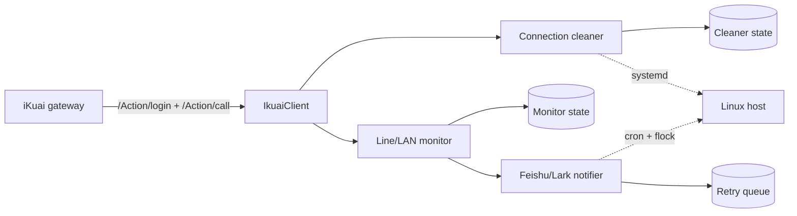

# Architecture

This repository is a sanitized portfolio version of automation that previously ran in a personal homelab. The production deployment is retired; the code is retained to document the engineering approach.

## Connection-cleaner decision path

1. Poll `monitor_lanip`.
2. Restrict actions to explicitly allowed address ranges.
3. Ignore exception addresses.
4. Determine the active group from configured time windows.
5. Require consecutive low-upload samples before taking action.
6. Enforce a per-IP cooldown and per-cycle clear limit.
7. Call `monitor_lanip/del_conn` only after all guards pass.

The original deployment used different schedules for multiple endpoint groups and a stricter rule for selected high-connection-count hosts. Those mechanisms remain configurable in the sanitized version.

## Monitor decision path

The monitor combines several iKuai API views:

- `wan` for WAN/PPPoE status;
- `monitor_lanip` for observed LAN and line presence;
- `dhcp_static` for the expected LAN inventory.

State is persisted between runs to distinguish a new outage from an already-reported outage and to emit recovery notifications. Expected PPPoE-line tracking uses a consecutive-miss threshold to reduce alerts caused by transient API omissions.

## Security / sanitization

The public version intentionally removes the original deployment's router credentials, PPPoE account identifiers, internal host labels, production paths, notification credentials and site-specific addresses. Credentials are injected through environment variables and configuration examples use documentation-only values.
